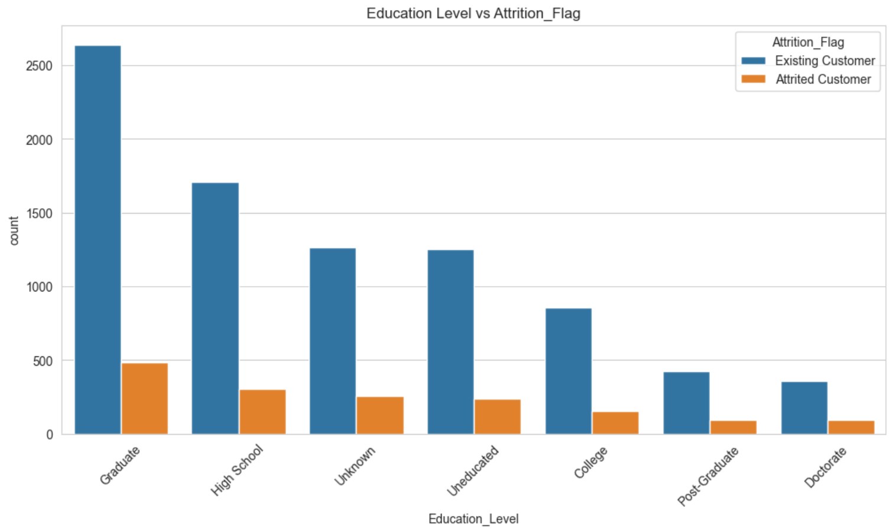

# Churn Prediction 📉

Predict customer churn with machine learning models and assist financial institutions in retaining their valuable clients.

📊 Data-driven Decisions
🤖 Advanced Predictive Models
📈 Maximizing Customer Retention

## 📌 Table of Contents

- [About the Project](#about-the-project)
- [Getting Started](#getting-started)
  - [Prerequisites](#prerequisites)
  - [Installation](#installation)
- [Usage](#usage)
- [Data Sources](#data-sources)
- [📊 Visuals](#visuals)
- [🤝 Contributors](#contributors)
- [📅 Timeline](#timeline)

## 📜 About the Project

The financial sector is witnessing an alarming rate of customer churn, with institutions losing their clientele to competitors. This project aims to:

- Predict customers with a high likelihood of closing their bank accounts.
- Group customers and define their characteristics for targeted marketing campaigns.

### Prerequisites

- Python 3.x
- Jupyter Notebook (for `.ipynb` files)

### Installation

1. Clone the repo:
   ```sh
   git clone https://github.com/MakotoUwu/Churn_prediction.git
   ```
2. Install all requirements:
   ```sh
   pip install -r requirements.txt
   ```
3. Run main.py:
   ```sh
   python main.py
   ```

## Usage

Open notebook in notebooks folder and you will see all date

## Data Sources

[Information about the data sources used in this project]

## 📊 Visuals



## 🤝 Contributors

Oleksandr Tsepukh

## 📅 Timeline

This project was completed over a period of 4 days, demonstrating efficient and focused efforts in tackling this critical issue.